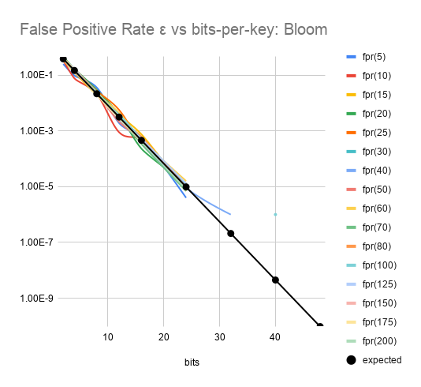
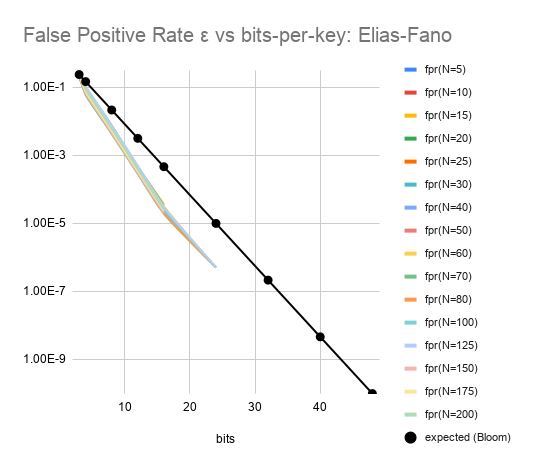

# Elias-Fano Encoding for AMQ Filter - Experiment

This repo contains code which compares Bloom Filters against a sorted
list of "fingerprint" hashes.  The research question is: Can one
achieve a better bit-rate per false-positive-rate ratio in AMQ filters
(vs de facto standard Bloom Filters), without sacrificing
enumerability (i.e., the ability to query an approximate set to
enumerate its members)?

The answer is yes;
[Elias-Fano](https://www.antoniomallia.it/sorted-integers-compression-with-elias-fano-encoding.html)
is a superior representation in terms of accuracy-per-space:

<table border='0'><tr>
<td width='50%'></td>
<td width='50%'></td>
</tr><tr>
<td width='50%'>
Bloom Filter performance; implementation aligns with theoretical expectation.
</td>
<td width='50%'>
Sorted Fingerprints, with Elias-Fano encoding.
</td>
</tr></table>

The use case we have in mind is error-detection/correction data
embedded into microservice observability traces.  For this use case,
queries are infrequent, as they only occur when data has been lost;
i.e., when a "hole" in collected data is suspected.

## Details

Both filter types are implemented using the XXH3 hash function family.
For the Bloom Filter, which requires `k` hash functions, we generate
`k` distinct random seeds; for Elias-Fano, which only requires a
single hash per inserted item, we use the default seed value (`0`).

Elias-Fano Filter works by first calculating the number of fingerprint
bits which can be stored per key.  These bits may be stored explicitly
(as the remainder low-order bits of the full 64-bit hash), or
implicitly via the fact that the fingerprints are sorted.  We
calculate the number of _implicit_ bits per key as log2 _N_
(for _N_ keys); for this part of the stored fingerprint, we need only
store 2 bits in the serialized representation.  This is because we
store a bitmap next to the packed list of explicit fingerprint bits.
The bitmap contains a 0 for each fingerprint stored, separated by a 1
for each 'boundary' between high-order bits prefix value.  This
[article](https://www.antoniomallia.it/sorted-integers-compression-with-elias-fano-encoding.html)
does a very good job explaining the details of this approach.

For each filter type, we first generate 1 million pseudo-random 64-bit
integers to serve as keys, using `std::default_random_engine`.  This
set is partitioned into the first _N_ keys and everything else; the
first _N_ keys are inserted into a filter.  We then verify that the
filter correctly records the presence of these keys.  For the
remaining keys (which were _not_ inserted), we query the filter,
recording for each whether the response is a (true) negative, a true
positive, or a false positive.  This procedure is repeated for various
values of _N_, and for various budgets of bits-per-key (the space vs
accuracy trade-off).  See `filter.test.hpp` for details.

<!--We note that the reported bits-per-key for the Elias-Fano filter type -->
